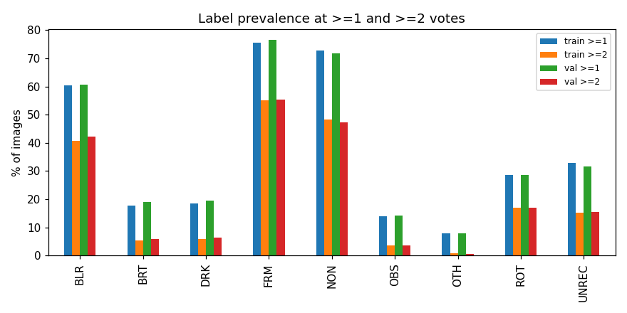
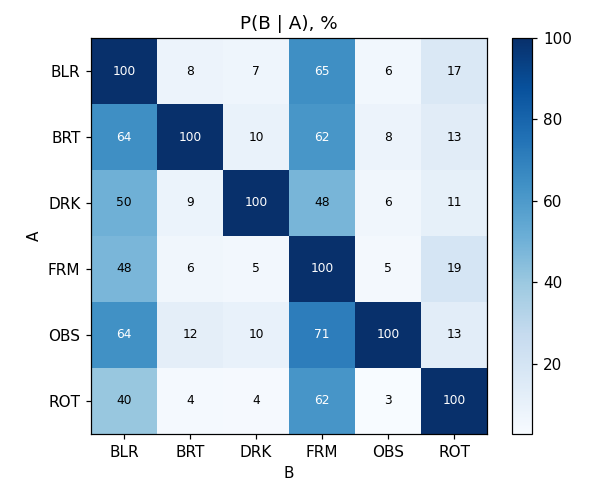
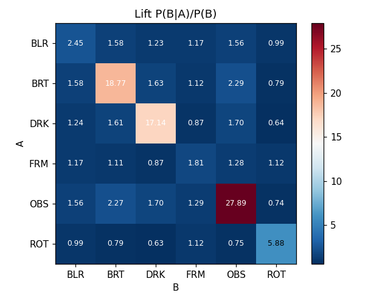
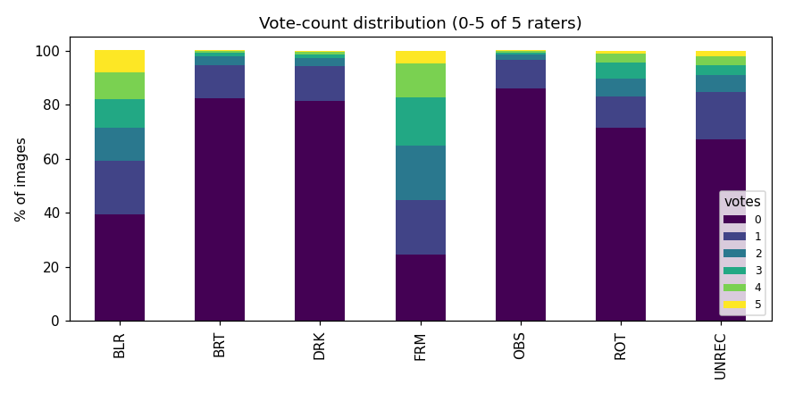
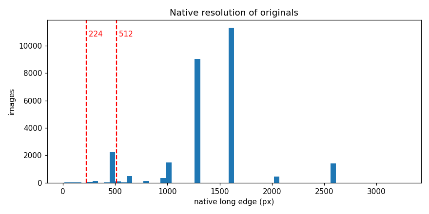
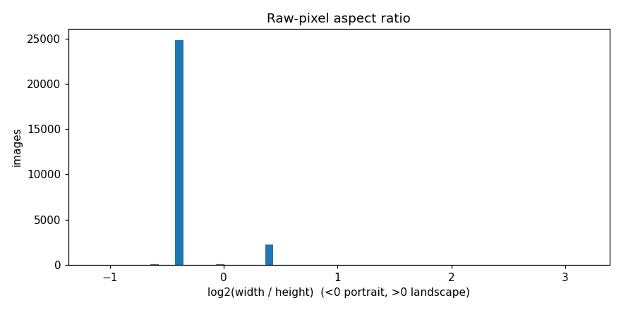

# Stage B: Exploratory Data Analysis

Partitions: train and val only. The test partition is not read during development.

## Environment

- Python 3.13.15 on Linux-6.6.122+-x86_64-with-glibc2.39
- RAM: 12.7 GB
- GPU: none (not needed: Stage B reads labels and image headers only)
- Seed: 42 (only randomness is the val/test split in src/data/splits.py)

## Findings and impact on the modelling plan

<!-- findings:start -->
1. **Train and val are the same population.** Every label's prevalence at
   >=2 votes agrees within 1.4 points between partitions (largest gap: BLR
   40.8% vs 42.2%). No partition-specific adjustment is needed.

2. **Native resolution: classical@512 is kept, with a thin margin.** 9.3% of
   train+val originals have a long edge below 512px, under the
   pre-registered 10% limit; 0.3% are below 224px. Median long edge is
   1296px. Because the margin is small, Stage C reports BLR performance at
   512 separately for natively-below-512 images (native dimensions are
   recorded per row) to show whether upsampling distorts the sharpness
   features. A small tail is near-degenerate (smallest long edge 13px,
   smallest file 0.8 KB); these keep their labels and stay in, and are
   inspected in error analysis.

3. **ROT has a geometry shortcut, and it is entirely the EXIF tag.** Raw
   pixel shape almost perfectly encodes the orientation tag: all 2,186
   orientation-6 images are landscape-shaped, against 144 of 25,120
   orientation-1 images. Landscape shape alone predicts ROT>=2 with AP
   0.258 against a 0.170 base rate (ROT rate 50.5% landscape vs 13.8%
   portrait). Within orientation 1, shape carries no signal (landscape
   images 3.4% ROT vs 13.8%, AP 0.137 at a 0.137 base rate). The padded CNN
   input preserves shape, so a CNN can reach about AP 0.26 on ROT without
   reading content. Impact: every ROT result is reported against this
   shape-only reference, and Stage F splits CNN ROT AP by EXIF orientation;
   ROT performance on orientation-1 images is the evidence that a model
   reads content. Preprocessing is unchanged, because the label refers to
   raw orientation.

4. **Annotator agreement is moderate at best, and FRM is the noisiest
   label.** Fleiss' kappa from the 5-rater vote counts ranges 0.22-0.41
   (BLR 0.41, ROT 0.38, UNREC 0.37, DRK 0.27, FRM 0.24, OBS 0.23, BRT 0.22).
   FRM has 37.7% of images at the 2-3 vote boundary, where the >=2 label
   flips on one rater. Expect a low ceiling on FRM for every arm; the Stage
   G human ceiling is required to interpret FRM scores.

5. **Flaws co-occur with blur.** P(BLR | flaw) is 64% for BRT, 64% for OBS
   and 50% for DRK (lift 1.2-1.6). A model can score on DRK or BRT partly
   through blur cues, and the reverse. Impact: error analysis reports
   per-flaw results on images carrying that flaw alone, so that a classical
   win on a photometric flaw is not a proxy for blur. ROT is close to
   independent of the other flaws (lift 0.6-1.1).

6. **DRK, OBS and BRT drive unrecognisability; ROT does not.**
   Unrecognisable (>=2) rate is 48.0% with DRK, 48.1% with OBS and 41.6%
   with BRT, against 13-14% without; FRM 19.2% vs 10.2%. Images with ROT
   are less often unrecognisable (8.4% vs 16.6%, ratio 0.51), consistent
   with ROT being partly a display artifact. The rate rises steadily with
   the number of flaws (2.0% with none, 22.9% with two, 47.7% with four).
   Impact on the Stage H demo: retake instructions prioritise DRK, OBS and
   BRT; ROT is the lowest priority and is often fixable in software rather
   than by retaking.
<!-- findings:end -->

## Prevalence (% of images)

| index | train >=1 | train >=2 | val >=1 | val >=2 |
|---|---|---|---|---|
| BLR | 60.5 | 40.8 | 60.6 | 42.2 |
| BRT | 17.7 | 5.3 | 19.1 | 5.8 |
| DRK | 18.5 | 5.8 | 19.5 | 6.3 |
| FRM | 75.6 | 55.2 | 76.5 | 55.4 |
| NON | 72.7 | 48.4 | 71.7 | 47.3 |
| OBS | 13.9 | 3.6 | 14.3 | 3.5 |
| OTH | 8 | 0.8 | 8 | 0.6 |
| ROT | 28.6 | 17 | 28.7 | 17.1 |
| UNREC | 32.8 | 15.2 | 31.7 | 15.6 |

## Flaw co-occurrence (train, >=2 votes)

P(B | A), %:

| index | BLR | BRT | DRK | FRM | OBS | ROT |
|---|---|---|---|---|---|---|
| BLR | 100 | 8.4 | 7.2 | 64.6 | 5.6 | 16.9 |
| BRT | 64.3 | 100 | 9.5 | 61.6 | 8.2 | 13.4 |
| DRK | 50.5 | 8.6 | 100 | 48.1 | 6.1 | 10.9 |
| FRM | 47.7 | 5.9 | 5.1 | 100 | 4.6 | 19.1 |
| OBS | 63.6 | 12.1 | 9.9 | 71 | 100 | 12.6 |
| ROT | 40.4 | 4.2 | 3.7 | 61.9 | 2.7 | 100 |

Lift P(B | A) / P(B):

| index | BLR | BRT | DRK | FRM | OBS | ROT |
|---|---|---|---|---|---|---|
| BLR | 2.45 | 1.58 | 1.23 | 1.17 | 1.56 | 0.99 |
| BRT | 1.58 | 18.77 | 1.63 | 1.12 | 2.29 | 0.79 |
| DRK | 1.24 | 1.61 | 17.14 | 0.87 | 1.7 | 0.64 |
| FRM | 1.17 | 1.11 | 0.87 | 1.81 | 1.28 | 1.12 |
| OBS | 1.56 | 2.27 | 1.7 | 1.29 | 27.89 | 0.74 |
| ROT | 0.99 | 0.79 | 0.63 | 1.12 | 0.75 | 5.88 |

Joint counts:

| index | BLR | BRT | DRK | FRM | OBS | ROT |
|---|---|---|---|---|---|---|
| BLR | 9552 | 803 | 691 | 6168 | 534 | 1612 |
| BRT | 803 | 1248 | 118 | 769 | 102 | 167 |
| DRK | 691 | 118 | 1367 | 658 | 83 | 149 |
| FRM | 6168 | 769 | 658 | 12934 | 596 | 2468 |
| OBS | 534 | 102 | 83 | 596 | 840 | 106 |
| ROT | 1612 | 167 | 149 | 2468 | 106 | 3986 |

## Vote distributions (train, % of images)

| index | 0 | 1 | 2 | 3 | 4 | 5 |
|---|---|---|---|---|---|---|
| BLR | 39.5 | 19.8 | 12.2 | 10.5 | 10 | 8.1 |
| BRT | 82.3 | 12.4 | 3.1 | 1.3 | 0.7 | 0.3 |
| DRK | 81.5 | 12.6 | 3 | 1.3 | 1 | 0.6 |
| FRM | 24.4 | 20.4 | 19.9 | 17.9 | 12.5 | 4.9 |
| OBS | 86.1 | 10.4 | 1.9 | 0.8 | 0.6 | 0.3 |
| ROT | 71.4 | 11.6 | 6.6 | 5.8 | 3.5 | 1.1 |
| UNREC | 67.2 | 17.6 | 6.1 | 3.7 | 3.1 | 2.3 |

## Annotator agreement (train)

| index | fleiss_kappa | unanimous % | borderline 2-3 % | positive >=2 % |
|---|---|---|---|---|
| BLR | 0.406 | 47.591 | 22.654 | 40.767 |
| BRT | 0.222 | 82.579 | 4.336 | 5.326 |
| DRK | 0.271 | 82.066 | 4.276 | 5.834 |
| FRM | 0.238 | 29.341 | 37.736 | 55.2 |
| OBS | 0.228 | 86.304 | 2.702 | 3.585 |
| ROT | 0.379 | 72.553 | 12.377 | 17.012 |
| UNREC | 0.371 | 69.489 | 9.825 | 15.185 |

## Unrecognisable rate by number of flaws (train, >=2 votes)

| n_flaws | n | unrecognisable_pct |
|---|---|---|
| 0 | 5469 | 2 |
| 1 | 8704 | 11.4 |
| 2 | 6877 | 22.9 |
| 3 | 2080 | 35.3 |
| 4 | 277 | 47.7 |
| 5 | 23 | 52.2 |
| 6 | 1 | 100 |

## Unrecognisable rate by flaw (train, >=2 votes)

| index | n with flaw | unrec % \| flaw | unrec % \| no flaw | ratio |
|---|---|---|---|---|
| BLR | 9552 | 26.6 | 7.3 | 3.64 |
| BRT | 1248 | 41.6 | 13.7 | 3.04 |
| DRK | 1367 | 48 | 13.2 | 3.65 |
| FRM | 12934 | 19.2 | 10.2 | 1.88 |
| OBS | 840 | 48.1 | 14 | 3.44 |
| ROT | 3986 | 8.4 | 16.6 | 0.51 |

## Native resolution (train + val)

| index | long edge (px) |
|---|---|
| p0 | 13 |
| p1 | 324 |
| p5 | 480 |
| p10 | 648 |
| p25 | 1296 |
| p50 | 1296 |
| p75 | 1632 |
| p100 | 3264 |

- long edge < 224 %: 0.34
- long edge < 512 %: 9.32

Pre-registered upsampling rule:

- KEEP 224: 0.3% of originals below it (limit 10%)
- KEEP 512: 9.3% of originals below it (limit 10%)

## Aspect ratio and file size (train + val)

Raw pixel shape by EXIF orientation:

| orientation | landscape | portrait/square |
|---|---|---|
| 1 | 144 | 24976 |
| 6 | 2186 | 0 |

| index | file size (KB) |
|---|---|
| count | 27306 |
| mean | 463.5 |
| std | 374.1 |
| min | 0.8 |
| 1% | 20 |
| 5% | 50.5 |
| 50% | 407 |
| 95% | 1259.7 |
| max | 3086.1 |

## ROT shortcut check (train, ROT >=2 votes)

ROT rate by EXIF orientation x raw pixel shape:

| orientation | shape | n | rot_rate |
|---|---|---|---|
| 1 | landscape | 118 | 3.4 |
| 1 | portrait/square | 21365 | 13.8 |
| 6 | landscape | 1948 | 53.4 |

Geometry-only cues scored as ROT predictors:

| index | n | cue on % | ROT prevalence % | AP | ROT % \| cue on | ROT % \| cue off |
|---|---|---|---|---|---|---|
| landscape-shaped pixels (all images) | 23431 | 8.8 | 17 | 0.258 | 50.5 | 13.8 |
| EXIF orientation 6 (all images) | 23431 | 8.3 | 17 | 0.265 | 53.4 | 13.7 |
| landscape-shaped pixels (orientation 1 only) | 21483 | 0.5 | 13.7 | 0.137 | 3.4 | 13.8 |
